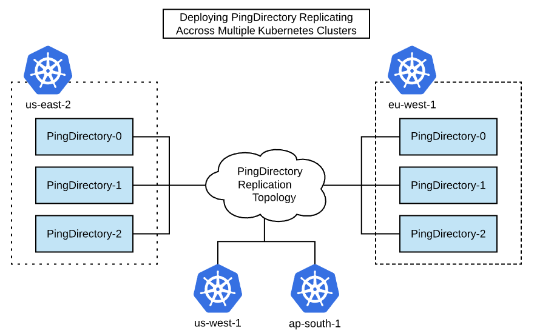
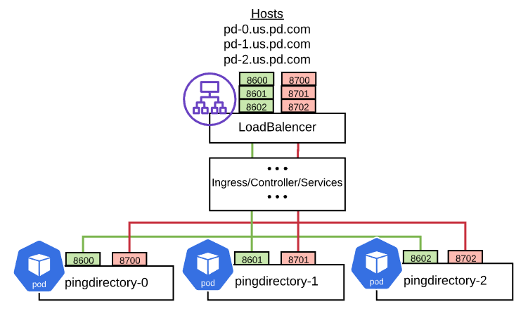
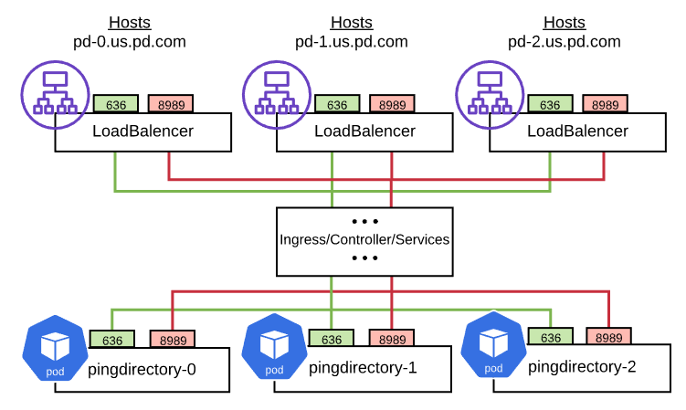

# 05-multi-k8s-cluster-pingdirectory

This directory is an extension of the `03-replicated-pingdirectory` example that deploys
PingDirectory across multiple kubernetes clusters/contexts



Because details within each Kubernetes cluster are well hidden from outside the cluster
access to each pod within the cluster is required externally.  The PingDirectory images 
will setup access to each of the pods (via external LoadBalancer(s)) from an external 
IP/Host to allow each pod to communicate over the ldaps and replication potocols.


## Modes of Deployment
There are two types of deployments depending on whether a single LoadBalancer (i.e. AWS NLB) 
or multiple LoadBalancers are used.

### Single LoadBalancer
Example of how a single LoadBalancer could be used:



* Advantages
  * Decreased cost of a single loadbalancer
  * Single IP Required
  * Easier DNS management
    * wildcard DNS domain
    * or seperate hosts pointing to LoadBalancer
* Disdvantages
  * More port mapping requirements
  * Lots of external ports to manage/track

### Multiple LoadBalancers
Example of how a single LoadBalancer could be used:



* Advantages
  * Use the same common/well-known port (i.e. 636/8989)
  * Separate IP Address per instance
* Disadvantes
  * DNS Management
    * Separate hostname required per instance

## Environment Variables Driving Configuration

| Variable                 | Required | Description |
|--------------------------|:--------:|------------------------------------------------------------------------------------------|
| K8S_CLUSTERS             | ***      | Represents the total list of kubernetes clusters that this stateful set will replicate to.
| K8S_CLUSTER              | ***      | Represents the kubernetes cluster this stateful set is being deployed
| K8S_SEED_CLUSTER         | ***      | Represents the kubernetes cluster that the seed server is deployed in
| K8S_NUM_REPLICAS         |          | Represents the number of replicas that make up this StatefulSet.
| K8S_POD_HOSTNAME_PREFIX  |          | String used to prefix all Hostnames.  Defaults to StatefulSet Name
| K8S_POD_HOSTNAME_SUFFIX  |          | String used to suffix all POD Hostnames.  Defaults to K8S_CLUSTER
| K8S_SEED_HOSTNAME_SUFFIX |          | String used to suffix all SEED Hostname.  Defaults to K8S_SEED_CLUSTER
| K8S_INCREMENT_PORTS      |          | rue or false.  If true, then each pod's port will be incremnted by 1


Example (See the resulting config below):

```
K8S_STATEFUL_SET_NAME=pingdirectory
K8S_STATEFUL_SET_SERVICE_NAME=pingdirectory

K8S_CLUSTERS=us-east-2 eu-west-1
K8S_CLUSTER=us-east-2
K8S_SEED_CLUSTER=us-east-2
K8S_NUM_REPLICAS=3

K8S_POD_HOSTNAME_PREFIX=pd-
K8S_POD_HOSTNAME_SUFFIX=.us-cluster.ping-devops.com
K8S_SEED_HOSTNAME_SUFFIX=.us-cluster.ping-devops.com

LDAPS_PORT=8600
REPLICATION_PORT=8700
```

| SEED | POD | Instance                   | Hostnane                       | LDAPS | REPL |
|:----:|:---:|----------------------------|--------------------------------|:-----:|:-----|
|      |     | CLUSTER: us-east-2
| ***  | *** | pingdirectory-0.us-east-2 | pd-0.us-cluster.ping-devops.com | 8600  | 8700 |
|      |     | pingdirectory-1.us-east-2 | pd-1.us-cluster.ping-devops.com | 8601  | 8701 |
|      |     | pingdirectory-2.us-east-2 | pd-2.us-cluster.ping-devops.com | 8602  | 8702 |
|      |     | CLUSTER: eu-west-1
|      |     | pingdirectory-0.eu-west-1 | pd-0.eu-cluster.ping-devops.com | 8600  | 8700 |
|      |     | pingdirectory-1.eu-west-1 | pd-1.eu-cluster.ping-devops.com | 8601  | 8701 |
|      |     | pingdirectory-2.eu-west-1 | pd-2.eu-cluster.ping-devops.com | 8602  | 8702 |

## Addiontal Kubernetes Resources Required
In addition to the StatefulSet, other resources are required to properly map the LoadBalancers to the
Pods.  The following provides an example to help describe each resource below.


### DNS
A DNS entry will be required at the LoadBalancer to point a wildcard domain or individual hostnames
to the LoadBalancer created by the NGINX Ingress Service/Controller

### NGINX Ingress Service/Controller
Several Components that map the ports from the external Load Balancer thru the NGINX Service and Controller.

* External Load Balancer   - Provides external IP and obtains definition from Ingress NGINX Service
* Ingress NGINX Service    - Mapping all port ranges (SEED_LDAPS_PORT, SEED_REPLICATION_PORT) to the same target port range
* NGINX Ingress Controller - Maps all port ranges to stateful set pods

> ***IMPORTANT NOTE***: Typically the NGINX Service and tcp-services (see below) require additional
> namespace access (i.e. `ingress-nginx-public`).  Be sure be aware of additional applications
> using this service/controller.

Example:

```
kind: Service
apiVersion: v1
metadata:
  name: ingress-nginx
  labels:
    app.kubernetes.io/name: ingress-nginx
    app.kubernetes.io/part-of: ingress-nginx
    app.kubernetes.io/role: ingress-nginx-public
  namespace: ingress-nginx-public
  annotations:
    service.beta.kubernetes.io/aws-load-balancer-type: nlb
spec:
  selector:
    app.kubernetes.io/name: ingress-nginx
    app.kubernetes.io/part-of: ingress-nginx
    app.kubernetes.io/role: ingress-nginx-public
  externalTrafficPolicy: Local
  type: LoadBalancer
  ports:
    - name: http
      port: 80
      targetPort: http
    - name: https
      port: 443
      targetPort: https
    - name: ldaps-pingdiretory-0
      port: 8600
      targetPort: 8600
    - name: ldaps-pingdiretory-1
      port: 8601
      targetPort: 8601
    - name: ldaps-pingdiretory-2
      port: 8602
      targetPort: 8602
    - name: repl-pingdiretory-0
      port: 8700
      targetPort: 8700
    - name: repl-pingdiretory-1
      port: 8701
      targetPort: 8701
    - name: repl-pingdiretory-2
      port: 8702
      targetPort: 8702
```

### NGINX TCP Services
ConfigMap (tcp-services) that provides the mappings from the target ports on the NGINX Controller to the
associated Pod Service (see below).

Example:
```
apiVersion: v1
kind: ConfigMap
metadata:
  name: tcp-services
  namespace: ingress-nginx-public
  labels:
    app.kubernetes.io/name: ingress-nginx
    app.kubernetes.io/part-of: ingress-nginx
    app.kubernetes.io/role: ingress-nginx-public
data:
  8600: "${PING_IDENTITY_K8S_NAMESPACE}/pingdirectory-0-service:8600"
  8601: "${PING_IDENTITY_K8S_NAMESPACE}/pingdirectory-1-service:8601"
  8602: "${PING_IDENTITY_K8S_NAMESPACE}/pingdirectory-2-service:8602"
  8700: "${PING_IDENTITY_K8S_NAMESPACE}/pingdirectory-0-service:8700"
  8701: "${PING_IDENTITY_K8S_NAMESPACE}/pingdirectory-1-service:8701"
  8702: "${PING_IDENTITY_K8S_NAMESPACE}/pingdirectory-2-service:8702"
```

### StatefulSet Pod Services
Provides a stateful set service for each pod

Example (of just one pod):
```
kind: Service
apiVersion: v1
metadata:
  name: pingdirectory-0-service
spec:
  type: ClusterIP
  selector:
    statefulset.kubernetes.io/pod-name: pingdirectory-0
  ports:
    - protocol: TCP
      port: 8600
      targetPort: 8600
      name: ldaps
    - protocol: TCP
      port: 8700
      targetPort: 8700
      name: repl
```
